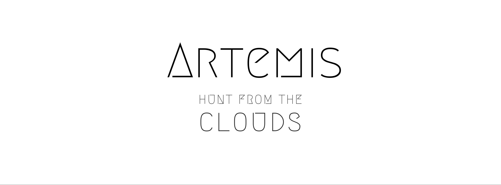

 
   
 

******

Docker Image for Pentesters and Bounty Hunters

- Images 
  - CTFs
  - Web 
  - Network 
  - Domains

**************
## FEATURES 

- Faster and Portable
- Latest Bug Hunting Methodology Tools
- Deployable on any  server
- Microservices Pentesting Tools
